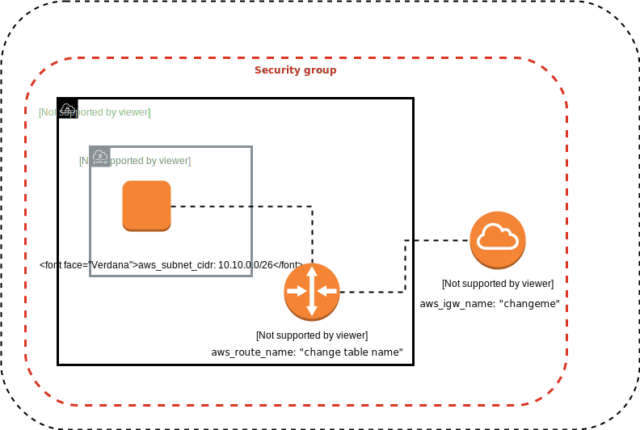

# ansible-aws-complete

[about variables ](/vars/readme.md)
[About VPC ](/roles/vpc/readme.md)
[About Gateway ](/roles/igw/readme.md)
[About Security Group ](/roles/sg/readme.md)
[About Keypair ](/roles/keypair/readme.md)
[About EC2 ](/roles/ec2/readme.md)

